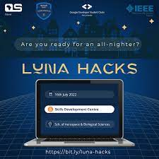

# LUNA HACKS 2.0
> Luna hacks 2.0 at Kabarak University



This has to be one of the most exciting hackathons I've ever attended,

Handled challenges in several languages including
- HTML
- Javascript
- Markdown
- Python

And other Software development tools like  __git__, __Github__, __CircleCI__, __Azure__, __Jenkins__, __github Actions__,  __makefiles__ and __docker__

Here is a list of what I was able to achieve

* [X] Deployed a static web app on github pages
* [X] Deployed a static web application on Azure
* [X] Wrote a github actions workflow for a team project
* [X] Implemented a CI/CD Pipeline iwth Circle CI
* [X] Learnt more about Pull Requests, github issues and github actions marketplace.

Here is a code sample of one of my projects

### Sample python code
```python
class User(object):
      """
      User class to handle user objects
      """
      def __init__(self, u_id):
      	  """
	  init method
	  Args:
		u_id(str): The user ID
	  """
	  self.u_id = u_id

```
### Sample Javascipt code

```javascript
console.log("Javascript is awesome");

```

### Sample c code

```c
int isOdd(int n){
    /*
    * see if `n` is odd
    * @n: the value to check
    * return: 1 if true, 0 else
    */
    if (n % 1 != 0){
       return (1);
       }

    else{
	return (0);
	}
}
```


